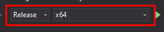
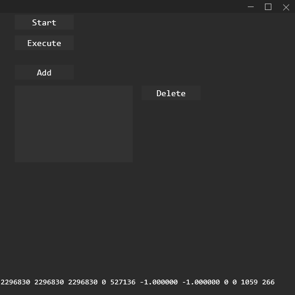
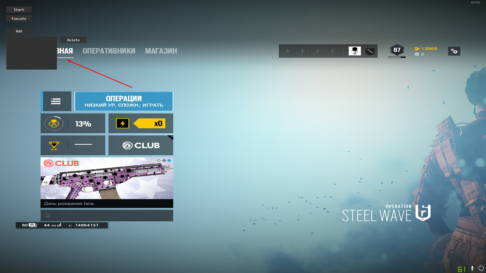

# SO RAW Autoclicker

# There's no autoclicker functions. It's just new features that be added in autoclicker in the future

# FAQ

## How to use?
1) Compile 2 projects 
 
2) Place compiled exe files in one folder 
3) To see the Overlay window open bootstrapper and press Alt + X or if you want to see normal window open GUI

## How to destroy Overlay?
1) Open Task Manager 
2) Find "Autoclicker GUI.exe" 
3) Choose and press End task

## View of the main window

## View of the Overlay that can cover all windows

## Credits
ADeltaX for parsing the CreateWindowInBandEx function https://blog.adeltax.com/window-z-order-in-windows-10/
